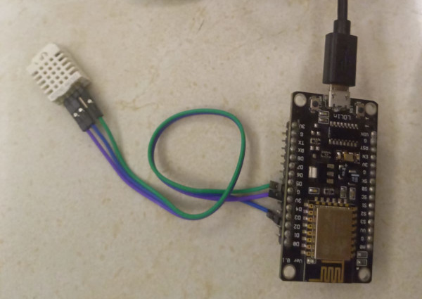

## Simple thermometer



```
$ mosquitto_sub -L mqtt://myuser:mypassword@my_mqtt_server/thermometer -i test
{"t": "29.2", "h":"38.9"}
{"t": "29.2", "h":"38.9"}
{"t": "29.2", "h":"38.8"}
{"t": "29.2", "h":"38.8"}
{"t": "29.2", "h":"38.9"}
...
```

Win11/WSL2 note: We will need to access the files of this repo from Windows too, so
clone/move this repo to some folder under `/mnt/c/Users/<your win username>`.

The toolchain setup will be more complex than the temperature measurement itself,
but then you can use this as a platform for future MicroPython projects too.


### Materials

- NodeMCU module, that already contains:
    - ESP8266 uC
    - CH340G USB-serial converter
    - DS1117 5V-to-3.3V voltage regulator, fed from the USB
    - LED on GPIO2
    - "Reset" button on RESET (with pull-up resistor, active low)
    - "Flash" button on GPIO0 (with pull-up resistor, active low)
    - Pull-up resistor on GPIO15

- SHT11 thermometer and hygrometer module

    Or DHT11, or SHT22, or DHT22, or AM2302, they have the same pinout and talk the same protocol,
    the difference is only in the maximal sampling rate

- 3 wires to connect the sensor and the uC (but you get them with the sensor).

Strictly speaking, you could reduce the total cost to about the half of this if you use only an
ESP8266 uC, the voltage regulator and the sensor chip (and one external serial converter), but
then it would require soldering and making your own PCB (or using a breadboard), so then the
hassle would grow to more than twice of this.

So, aiming for a *simple* thermometer, let's continue with the pre-manufactured modules...


### Software

- Flashing tool: [esptool.py](https://pypi.org/project/esptool/)
- Platform: [MicroPython](https://micropython.org/download/ESP8266_GENERIC/)
- A serial terminal (I recommend `picocom`)
- A few authentic home-grown python scripts :)

- An MQTT server somewhere in your LAN (I recommend `mosquitto`)


A summary of what we will do:
- Set up the serial port, so the Linux in WSL2 sees it too
- Create a backup of the original flash content of the NodeMCU
- Re-flash the NodeMCU with MicroPython
- Using the serial terminal enable the WebREPL (network console) of MicroPython
- Customize `config.py` with our own actual parameters
- Using WebREPL upload our firmware scripts to NodeMCU

And now the details :)


## Setting up NodeMCU

NodeMCU has a built-in CH340G usb-serial converter that is hooked up to the
RXD and TXD pins of the ESP8266:

```
CH340G      ESP8266
 3  TxD     22 U0TxD    via 470 Ohm
 4  RxD     21 U0RxD    via 470 Ohm
13  #DTR    18 GPIO0    via inverter, ie. #RTS=1 -> GPIO0=0 -> boot from serial
14  #RTS     1 #RST     via inverter, ie. #DTR=1 -> #RST=0  -> reset
```

This pinout is exactly compatible with what `esptool.py` expects :)


### Setting up the serial port

NOTE: The PowerShell steps are needed only if you're using WSL2 on Win11, on native Linux you may simply skip them.

- Connect the NodeMCU via a USB cable (make sure that it's not a charge-only cable).

- Open a PowerShell prompt

- PowerShell: Execute `usbipd list`

  You should see something like `2-2 1a86:7523  USB-SERIAL CH340 (COM5)`, note that `2-2`, that is the bus ID of the device.

- Open a WSL2 bash prompt

- Bash: `sudo /etc/init.d/udev restart`

  (Because in a stock WSL2 setup it's not started automatically.)

- If it's the first time with NodeMCU:
    - Open another PowerShell as Administrator
    - Execute `usbipd bind --busid 2-2`

      (This lets this device forwarded to the WSL2 domain.)
    - Close this Administrator PowerShell

    - Bash: Execute `sudo su -`
    - Create the new file `/etc/udev/rules.d/51-ch340g.rules`
    - Add this content:

```
# NodeMCU onboard usb serial converter
ACTION=="add", SUBSYSTEM=="tty", ATTRS{idVendor}=="1a86", ATTRS{idProduct}=="7523", MODE="660", GROUP="users", SYMLINK+="ttyNodeMCU"
```

      (This tells `udev` that when the device is attached, create the device node `/dev/ttyUSB?`,
      owned by "root:users" with permissions 660, and to create a symlink `/dev/ttyNodeMCU` to it.)

    - Execute `udevadm control --reload`
    - Exit the root shell

- PowerShell: `usbipd attach --wsl --busid 2-2` 

  Keep this PowerShell active

  (The Linux in the WSL2 domain will now sense this as if you just connected the device.)

- Bash: `lsusb`

  You should see something like `Bus 001 Device 002: ID 1a86:7523 QinHeng Electronics CH340 serial converter`

- Bash: `ls -l /dev/ttyUSB0`

  You should see `crw-rw---- 1 root users 188, 0 Aug  5 17:22 /dev/ttyUSB0`

- Bash: `ls -l /dev/ttyNodeMCU`

  You should see `lrwxrwxrwx 1 root root 7 Aug  5 17:22 /dev/ttyNodeMCU -> ttyUSB0`

- Now you're ready to work with the NodeMCU module

- At the end, when you no longer need it:

  PowerShell: `usbipd detach --busid 2-2` 

  (The Linux in the WSL2 domain will now sense this as if you just disconnected the device.)

  You may close the PowerShell now.


### Setting up `esptool.py`

First time when you set up the project:
```
mkdir .venv
python -m venv .venv
source .venv/bin/activate
pip install esptool
```

In subsequent times just activate the virtul environment:
```
source .venv/bin/activate
```

To test if everything works:
```
(.venv) $ esptool.py --port /dev/ttyNodeMCU chip_id
esptool.py v4.7.0
Serial port /dev/ttyNodeMCU
Connecting....
Detecting chip type... Unsupported detection protocol, switching and trying again...
Connecting....
Detecting chip type... ESP8266
Chip is ESP8266EX
Features: WiFi
Crystal is 26MHz
MAC: ??:??:??:??:??:??
Uploading stub...
Running stub...
Stub running...
Changing baud rate to 460800
Changed.
Chip ID: 0x????????
Hard resetting via RTS pin...

(.venv) $ esptool.py --port /dev/ttyNodeMCU flash_id
...
Manufacturer: 20
Device: 4016
Detected flash size: 4MB
...
```

### Installing MicroPython

Download the latest firmware from [micropython.org](https://micropython.org/download/ESP8266_GENERIC/).

As our flash is bigger than 2 MBs, no need for the crippled-down 1M or 512k versions, the normal one
will do fine.

```
(.venv) $ curl -LO https://micropython.org/resources/firmware/ESP8266_GENERIC-20240602-v1.23.0.bin
```

First make a backup of the original flash content:
```
(.venv) $ esptool.py --port /dev/ttyNodeMCU read_flash 0 ALL backup.bin
...
Changing baud rate to 460800
...
Read 4194304 bytes at 0x00000000 in 99.1 seconds (338.6 kbit/s)...
```

The reading protocol already contains error detection, so if it fails, just retry it once, and if
it fails again, halve the baud rate like `... read_flash --baud 230400 ...`, etc.

If you make multiple backups, don't be surprised if they differ in the last few 10 kbytes.
ESP8266 writes some network connection params there when the net is set up, so that on the next
reboot it can be restored automatically. We don't need this but it can't be turned off...

Now that we have a backup, let's erase the flash:
(In fact, this is not necessary per se, but when upgrading from earlier versions of MicroPython,
the format of persisted data may change, and that can lead to hard-to-debug situations.)
```
(.venv) $ esptool.py --port /dev/ttyNodeMCU erase_flash
...
Erasing flash (this may take a while)...
Chip erase completed successfully in 7.3s
```

And now let's flash MicroPython:
```
(.venv) $ esptool.py --port /dev/ttyNodeMCU write_flash --flash_size=detect 0 ESP8266_GENERIC-20240602-v1.23.0.bin
...
Flash will be erased from 0x00000000 to 0x0009afff...
Compressed 633048 bytes to 423611...
Wrote 633048 bytes (423611 compressed) at 0x00000000 in 9.6 seconds (effective 526.3 kbit/s)...
Hash of data verified.
...
```

Now the NodeMCU has MicroPython on it, and is running in AP mode
(as it has no parameters to connect to our local WiFi yet).

NOTE: If the LED is blinking real fast, then it's in a boot loop. In this case the ESP8266 boot loader
is looping, but it emits log messages on the serial console at 74880 baud, so `picocom /dev/ttyNodeMCU -b 74880`.
If you see something like `rf_cal[0] !=0x05,is 0xFF`, then you forgot the `--flash_size=detect` parameter :D

By default MicroPython runs a REPL on the serial console at 115200 baud, so `picocom /dev/ttyNodeMCU 115200`

```
$ picocom /dev/ttyNodeMCU -b 115200
...
Terminal ready

>>>
>>> help()
Welcome to MicroPython!
...
```

This is nice, but we need this REPL through network (to get rid of the serial twiddling),
so we need to enable it in the serial REPL:
```
>>> import webrepl_setup
WebREPL daemon auto-start status: disabled

Would you like to (E)nable or (D)isable it running on boot?
(Empty line to quit)
> E
To enable WebREPL, you must set password for it
New password (4-9 chars): <whatever>
Confirm password: <whatever again>
Changes will be activated after reboot
Would you like to reboot now? (y/n) y
...
WebREPL server started on http://192.168.4.1:8266/
Started webrepl in normal mode

MicroPython v1.23.0 on 2024-06-02; ESP module with ESP8266
Type "help()" for more information.
```

NOTE: The binary garbage in between is the ESP8266 boot loader output, because it transmits at 74880 baud and
we are listening at 115200.

Good news: From now we won't need `esptool.py`, as we'll do all the remaining steps via
WiFi and a browser :)


### Connecting to the REPL via network

After a fresh install and boot the device configures itself as a WiFi access point (AP) that you can connect to.

The ESSID is of the form `MicroPython-xxxxxx` where the x’s are replaced with part of the MAC address of your device
(so will be the same every time, and most likely different for all ESP8266 chips).

The password for the WiFi is `micropythoN` (note the upper-case N).

Its IP address will be 192.168.4.1 once you connect to its network.

To connect to it we'll need to open a WebSocket-based client in a browser, which can be accessed
online at [WebRepl](http://micropython.org/webrepl), but as now we'll connect to the NodeMCU AP, this won't be
accessible, so let's make a local copy of it:

```
$ git clone git@github.com:micropython/webrepl.git
```

Win11/WSL2 note: We will need to access the files of this repo from Windows too, so
clone this repo to some folder under `/mnt/c/Users/<your win username>`.

The moment of Truth #1: Connect to the NodeMCU AP, open `webrepl.html` in a browser and connect to `ws://192.168.4.1:8266` !

```
Welcome to MicroPython!                                                                                                                       
Password:                                                                                                                                     
WebREPL connected                                                                                                                             
>>>
```

So we may deactivate the virtual environment `(.venv) $ deactivate` and even close the Bash
as well. On Win11 we can detach the device from WSL2 `usbipd detach --busid 2-2` and close
the PowerShell too.

In fact, from here the NodeMCU needs USB only for power, so if we want, we can disconnect it
from the computer and plug it into a plain USB charger.


### Installing our "framework"

Our "framework" consists of two files: [`boot.py`](boot.py) and [`config.py`](config.py.sample)
(and the application will go to [`code.py`](code.py)).

By default MicroPython initializes the network and connects to the last used WiFi by using
persisted credentials automagically, which is nice as long as it doesn't change and is available.

If it's not, then the network setup fails and we need a serial console again, which is a real P.I.T.A.

I prefer more control over the process, i.e. I want to store the credentials myself in a plain file that I can modify
only whenever I want, (in contrast to some obscure binary flash area that persists the last used credentials
automagically), and I'd like to fall back to AP mode in case of any failure.

Besides, the normal boot process of MicroPython is executing (not importing!) `boot.py`, which is also nice, but
if there is any exception raised in that, then we're back to square zero again, and need a serial console to set
things right.

Additionally, RAM is a scarce resource on ESP8266, so I'd like to run `gc.collect()` after the network setup, etc.,
so sooner or later we'd arrive to having a minimal but robust `boot.py`, whose tasks are:

- Stop that stupid wifi-auto-connect thing even before it could start
- Import `config.py` which contains all our settings, including but not limited to WiFi credentials
- Try to connect to our WiFi (blink the LED as a progress indicator), and if it fails, enter AP mode
- In a `try..except` block try to import a `code.py`
- If importing `code.py` fails, just go on, so we can connect via WebREPL and fix it (eg. `import code` and see the error)

(NOTE: `main.py` is MicroPythons attempt to do something like this, but the concept behind it is sort of weak,
hence the different name `code.py`.)

Please copy `config.py.sample` to `config.py` and fill in the details as per the comments.
Try not to make typos in it, because at least the WiFi credentials are needed for having a WebREPL later,
so there is no way to tolerate syntax errors in this module.

NOTE: 2.4GHz WiFi only, as ESP8266 doesn't support 5GHz, sorry...

NOTE: Now you see why I prefer having the config in a civilized format: we may even have comments...

Moment of Truth #2: Using the WebREPL in your browser, upload `config.py` and `boot.py` (in this order, to
prevent inconsistent state in case you fail to upload the second one), and reboot the NodeMCU !

If everything went well, then after some blinking the LED goes off, the NodeMCU is now connected to your wifi,
and you can reload `webrepl.html` and connect to it via its new IP address.

If not, then the LED stays on, you see an open AP `NodeMCU`, connect to that, then connect WebREPL to
`ws://192.168.4.1:8266` and try to fix and upload that `config.py` :)

BTW fixing boot/init problems, a useful copy-paste code for starting the wifi from a serial console:
```
import network, config, webrepl
wlan = network.WLAN(network.STA_IF)
wlan.connect(config.wifi_ssid, config.wifi_password)
wlan.isconnected()
webrepl.start()
```


### The application

At this point we have no `code.py` on the NodeMCU, so of course there is nothing to run, but `boot.py` is robust enough
to live with that, so we still have WiFi connection and a WebREPL (and a `Failed to import code: no module named 'code'`
message on the serial console).

BTW, this will happen if we make any mistake in our future `code.py`, so even if it fails to import, and we don't need
a serial connection to fix it...

So, we need to upload [`code.py`](code.py), but first let's take a look at what it actually does :)

Luckily, the ESP8266 port of MicroPython already contains modules for:

- Interfacing an SHT/DHT sensor: [dht](https://docs.micropython.org/en/latest/esp8266/quickref.html#dht-driver)
- A simplistic MQTT module: [umqtt.simple](https://pypi.org/project/micropython-umqtt.simple) (here's the
[source](https://github.com/micropython/micropython-lib/tree/master/micropython/umqtt.simple))

The `umqtt.simple` module isn't really over-documented, but take a look at [`example_pub.py`](https://github.com/micropython/micropython-lib/blob/master/micropython/umqtt.simple/example_pub.py) and you'll see that it doesn't need it either.

What our `code.py` does cannot be any simpler:

- Connect to the MQTT server using the credentials in `config.py`
- Take a measurement using the `dht` module
- Format it into a nice JSON string
- Publish that string to the MQTT server to the topic in `config.py`
- Wait some
- Repeat this from taking the next measurement, until the power goes down
- (And reconnect to the server if the connection is lost)

You may upload `code.py`, but you may choose to actually connect the sensor to the NodeMCU first :) !


## Connecting the sensor


### Short version for the impatient

- Sensor Vdd (pin 1) : NodeMCU 3.3V (marked as "3V3")
- Sensor Data (pin 2) : NodeMCU GPIO4 (marked as "D2")
- Sensor GND (pin 4) : NodeMCU GND (marked as "GND")


### Significantly longer version for the curious

ESP8266 has one ADC input and 17 GPIO pins (GPIO0 to GPIO16), but some of these latter ones have extra purposes when the chip is booting, and this must be taken into consideration.

As I intend this project as a base for future projects too, it's worth to understand the wider picture and not just focusing on this thermometer application.

1. GPIO6 to GPIO11 are used to interface the internal flash of the ESP8266, so these are completely out of use for us.


2. GPIO0, GPIO2 and GPIO15 are used to select the boot mode (ie. from flash, from serial, etc.) when the chip is powered up

To boot from flash, GPIO0 and GPIO2 are pulled up and GPIO15 is pulled down by 10k external resistors. To boot from serial (like during flashing) GPIO0 is pulled down hard by the "Flash" button.

This means that these pins cannot be used for anything that would pull them away during power-up, or for anything that couldn't take these static pull ups/downs.

3. GPIO0: boot mode select (with a pull-up resistor and a pull-down button)

As GPIO0 already has a button connected, it's reasonable to re-use it as an application-specific button, so *during power-up* it selects the normal or flashing boot, and *when the application is already running* it means whatever the application wants to.

4. GPIO2: boot mode select (with a pull-up resistor), UART1 TXD

ESP8266 has one bidirectional UART0 and a transmit-only UART1, and this pin is the output of this UART1.

What complicates the matters is that during boot the ESP8266 boot loader sends a lot of output (at 74880 baud) not just to UART0 but to UART1 too, so during boot this pin will be driven and have garbage traffic on it.

Therefore we can't use it for anything that would pull it away (and select a wrong boot mode) or that couldn't take this garbage traffic.

The best purpose I found for this is to use it as a serial debug/log output, or attach a pull-down button to it, similar to the "Flash" button on GPIO0.

5. GPIO15: boot mode select (with a pull-down resistor)

Again, we can't hook anything to it that would pull it away during power-up, but otherwise it's free for use.

Although, as it already has a pull-down resistor, using it for a pull-up button is a good idea, but there is one more thing.

If we're interfacing with a peripheral that uses serial communication (eg. a GPS), using UART0 is a bad idea, because during boot and during flashing a lot of data is sent through it, and it may interfere with this peripheral.

However, ESP8266 has a feature to swap U0TXD/GPIO1 and U0RXD/GPIO3 with GPIO15 and GPIO13, so we can hook the peripheral to those, and *after the boot has finished* do we initiate this swapping, so no boot logs or flashing data hits the peripheral or is corrupted by its response.

So I'd dedicate this GPIO15 as the TXD of this *isolated* serial communication.

NOTE: To activate this, specify the `.., tx=15, rx=13, ...` parameters to [UART](https://docs.micropython.org/en/latest/library/machine.UART.html#machine.UART.init).

NOTE: ESP8266 has a hardware-implemented SPI port that also uses this pin, so if we need HSPI, then this may be used for that. May but not must, as a software-SPI can be implemented easily on any other pins too.

6. GPIO13: alternative pin for U0RXD

As described above, we can use it as the RXD of that *isolated* serial communication.

Otherwise, it's absolutely free for any arbitrary use

7. GPIO16: wake-up from deep sleep

This pin is internally implemented in a different way, so ESP8266 can only pull it down, but not up. This could be remedied by adding an external pull-up resistor of course, but it's better to use it either as a wake-up signal (if we need that) or driving some externally pulled-up common rail, or as an input (if we don't)

8. GPIO1: U0TXD

This is output of the the serial port UART0, so it is heavily used during flashing, and also as output to transmit the boot loader garbage during boot.

We can't hook up anything here that would disrupt the flashing data, or that couldn't take this data, so I'd recommend only some non-essential output like a status LED

9. GPIO3: U0RXD

This is the input of the serial port UART0, so all the flashing data is sent through this.

We can't hook up anything here that would disrupt that data, or that couldn't take it, so again it's best to use as non-essential output.

10. GPIO4 and GPIO5

No extra quirks, these pins are ready for anything :D

11. GPIO12 to GPIO15

These can be used by the HSPI interface, but please note that it collides with the already mentioned *isolated* UART0 pins, so it's either-or.


### Summary

- GPIO0: Re-use it as an app-specific button 
- GPIO1: Non-essential output like some LED
- GPIO2: Re-use it as debug log output, or non-essential output, or as an input with a pull-down button
- GPIO3: Non-essential output like some LED
- GPIO4 and GPIO5: *free for use*
- GPIO12: HSPI, or *free for use*
- GPIO13: Alternate U0RXD for *isolated* serial, otherwise *free for use*
- GPIO14: HSPI, or *free for use*
- GPIO15: Alternate U0TXD for *isolated* serial, or HSPI, otherwise *free for use*
- GPIO16: Wake-up input, or *free for use*, especially for common-rail pull-down purposes

Therefore, for this thermometer data line we could use GPIO4, GPIO5, or any of GPIO12 to GPIO15, so for simplicity's sake let's use GPIO4.


## Getting it running

First of all, check if the MQTT server is indeed working.

Terminal for listener:
```
$ mosquitto_sub -L mqtt://myuser:mypassword@my_mqtt_server/thermometer -i test1
```

Terminal for sender:
```
$ mosquitto_pub -L mqtt://myuser:mypassword@my_mqtt_server/thermometer -i test2 -m "qwerqwer"
```

If it works, then close the sender terminal but leave the listener running :)

Upload `code.py`, reboot the NodeMCU, wait until it reconnected to the WiFi (LED goes off).

Open WebREPL, check if you see the output of `code.py`.

If not, try to manually import it `import code` to see if there are any errors.

If you see `Connection failed` or `Connection broken`, then check the MQTT parameters in `config.py`.

If you just see `measuring`, then check the wiring between NodeMCU and the sensor.

If you see the measurement results, and no connection errors, then check the listener terminal,
because it should get the messages too :).


## Useful links

- [ESP8266 datasheet](https://espressif.com/sites/default/files/documentation/0a-esp8266ex_datasheet_en.pdf)
- [NodeMCU pinout](https://lastminuteengineers.com/wp-content/uploads/iot/ESP8266-Pinout-NodeMCU.png)
- [DHT22 datasheet](https://www.sparkfun.com/datasheets/Sensors/Temperature/DHT22.pdf)

- [esptool.py](https://pypi.org/project/esptool/)
- [MicroPython](https://docs.micropython.org/en/latest/esp8266/quickref.html)
- [WebREPL client](https://github.com/micropython/webrepl)
- [dht module](https://docs.micropython.org/en/latest/esp8266/quickref.html#dht-driver)
- [umqtt.simple](https://github.com/micropython/micropython-lib/tree/master/micropython/umqtt.simple)


## ESP-01 Notes

### Pinout

```
|         |
| 1 2 3 4 |
| 5 6 7 8 |
+---------+
```

IMPORTANT: Some docs number the lower row in the other direction, I'm following the original AI-Thinker numbering.


### Setup and boot

`boot mode: (x, y)` -> x = (GPIO15, GPIO0, GPIO2)

- 1: GND
- 2: GPIO2
- 3: GPIO0, 1,NC=normal boot (mode 3), 0=uart boot (mode 1)
- 4: RxD
- 5: TxD, - 2k2 - blue LED - Vcc
- 6: EN, 1=normal operation, NC,0=no operation
- 7: Reset, 1,NC=normal operation, 0=no boot, 0->1: reset
- 8: Vcc = 3.3V

Vcc - red LED - 4k7 - GND

(7=Reset) - 470 - 12k up, 24k down - chip Reset

For static pull-ups (EN, GPIO2) 4.7k is adequate. Don't use too small values, as GPIO2=U1TXD is a (garbage) output
during boot, and it would be overdriven when low.

Also don't try to feed EN and GPIO2 from the same resistor, as when GPIO2 is sending the bootloader output, it would
pull down EN at the first 0 :)

For normal operation, the minimal setup is: GND, Vcc, RxD, TxD, EN=1


```
$ esptool.py -p /dev/ttyFT232H chip_id
Detecting chip type... ESP8266
Chip is ESP8266EX
Features: WiFi
Crystal is 26MHz
MAC: ??:??:??:??:??:??
Chip ID: 0x????????

$ esptool.py -p /dev/ttyFT232H flash_id
Manufacturer: d8
Device: 4014
Detected flash size: 1MB
```

NOTE: For this module we need the 1M version of MicroPython.

## GPIO arrangement

The blue LED is wired between TxD (GPIO1) and Vcc via 2.2k,
so it's on when GPIO0=0.

There is no in-circuit programming here (the module must be
disconnected from the application circuitry for flashing),
so we are free to re-use TxD and RxD, and also the initial values
of GPIO0 and 2 can (and must) be always 1.

We have 4 GPIO lines:

- GPIO0

    At power-up it must not be low (i.e. is 1 or NC).

- GPIO1 = TxD

    The blue LED is connected here, and it's junk output at boot, so we can't sink too much current through it, and as
    an input it's pulled up. Not much use, honestly, except for the LED.

- GPIO2

    At power-up it must not be low (i.e. is 1 or NC), and it's junk output at boot.

- GPIO3 = RxD

    Available without restrictions


## config.py differences

So, the LED is on GPIO1 and let's connect the sensor to GPIO3=RXD

```
wifi_led_gpio = -1 # TxD
dht_gpio = 3 # RxD
```
